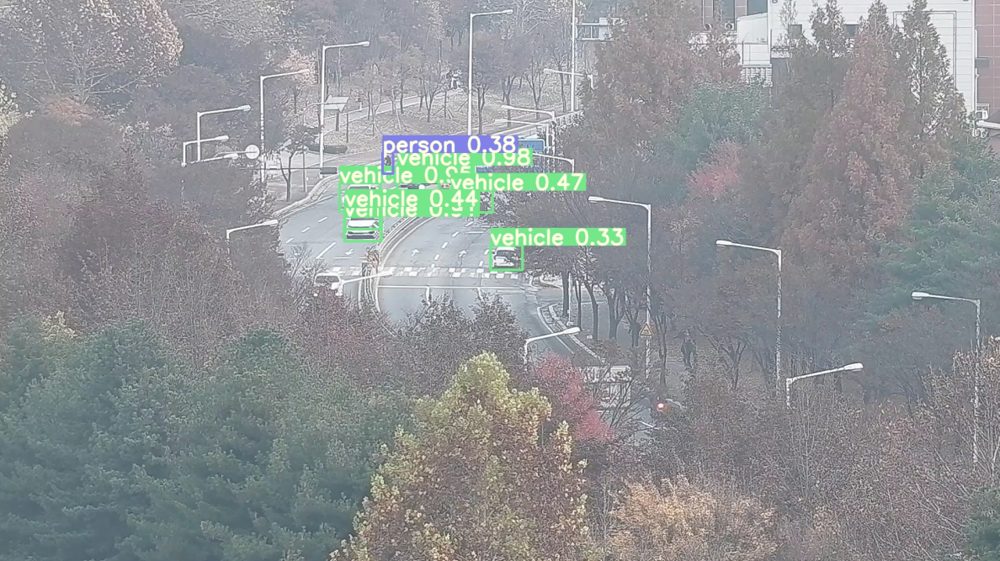

## Object Detection on Thermal Images
YOLO v3 object detection model both on RGB and Infrared video. When it comes to real-time object detection it puts out its result as jpg forms, which helps a server to load its result more easily.

### Instructions

- run pip install requirements, or click into the requriements.txt file for the Anaconda commands.

- download pre-trained weight file (https://drive.google.com/file/d/1BRJDDCMRXdQdQs6-x-3PmlzcEuT9wxJV/view?usp=sharing)

- place pre-trained weight file in weights folder

### Run Code:

#### - To run on webcam
python detect.py --data data/coco.data --cfg cfg/yolov3.cfg --weights weights/yolov3.weights --source 0

#### - To run on video
python detect.py --data data/coco.data --cfg cfg/yolov3.cfg --weights weights/yolov3.weights
